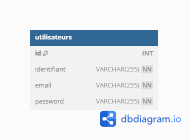

# Page Web d'inscription à un service

#### Fait par Haar Fabien et Sofianos Lucas
Groupe FI

le 13/02/2024 

# Points clés
## Résumé du script maitre `run_all.sh`
| **Etape** |                                                                                                                                           **Qu'est-ce qu'il se passe**                                                                                                                                          |
|:---------:|:---------------------------------------------------------------------------------------------------------------------------------------------------------------------------------------------------------------------------------------------------------------------------------------------------------------:|
| Purge     | On demande à l'utilisateur s'il veut faire une purge, cela permettra de détruire tout ce qui pourrait gêner la bonne execution du projet                                                                                                                                                                        |
| 1         | Création du réseau sur lequel seront mis les conteneurs, cela permettra d'interagir correctement avec la base de données                                                                                                                                                                                        |
| 2         | Lancement du conteneur mysql avec à l'aide d'options `--env` de créer directement la base de données ainsi que l'utilisateur qui permettra à l'application python de se connecter. Il y a une pause pour être sûr que le conteneur soit accessible, puis une requête est faite pour créer la table utilisateur. |
| 3         | Construction de l'image de l'application python flask                                                                                                                                                                                                                                                           |
| 4         | Lancement du conteneur de l'application python flask                                                                                                                                                                                                                                                            |
| 5         | Lancement du navigateur sur `localhost:5000` qui affiche la page d'acceuil du site. si cette étape échoue, on peut aller sur un navigateur et rentrer l'URL manuellement. 

## Base de données utilisée 

# Troubleshooting : 
## Base de données :
Plusieurs problèmes concernant la base de données ont pu être constatés : 

* La base de données ne contenait pas la table voulue, on ne pouvait faire aucun tests. Il y avait certianement un conflit entre la création de la base de données et ensuite via la requête SQL pour créé la table (qui créait aussi la base de données). Ce problème a été temporairement réglé en créant la base de données uniquement via la requête sans la créer vide via par la création du conteneur.
* L'utilisateur python ne pouvait pas accèder à la base, ce problème découlait directement du précédent car l'utilisateur créé par le conteneur a les droits sur la base de données uniquement si la base est créée par la création du conteneur. 

Tous ces problèmes sont définitivement résolues par l'adaptation des options ssuivantes sur les conteneur : 
`--env MYSQL_USER=python` 
`--env MYSQL_PASSWORD=python` 
`--env MYSQL_DATABASE=sae61` 
Ainsi que l'execution de la commande : 
`mysql -u python -p'python' -h 127.0.0.1 --port=3306 < "sql/sae61.sql"` 
Avec dans le fichier sae61.sql :   
`USE sae61;` 
 `CREATE TABLE utilisateurs (` 
  `id INT AUTO_INCREMENT PRIMARY KEY,` 
  `identifiant VARCHAR(255) NOT NULL,` 
  `email VARCHAR(255) NOT NULL,` 
  `password VARCHAR(255) NOT NULL` 
`);` 
 
C'est cette association qui permet la bonne création de la base de données utilisable par l'utilisateur python.